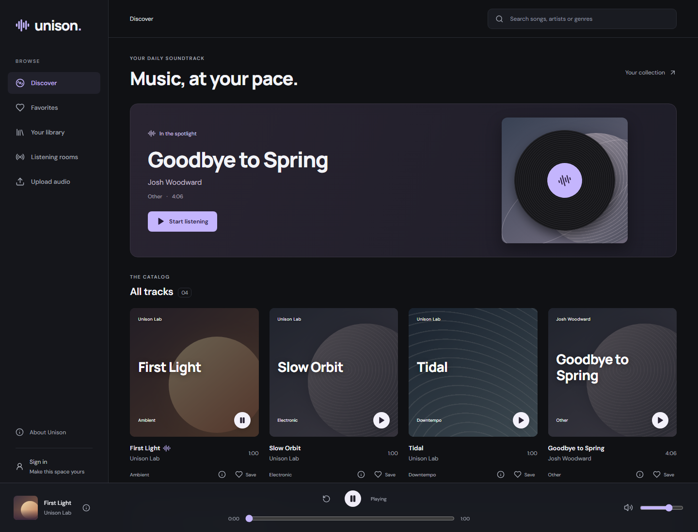
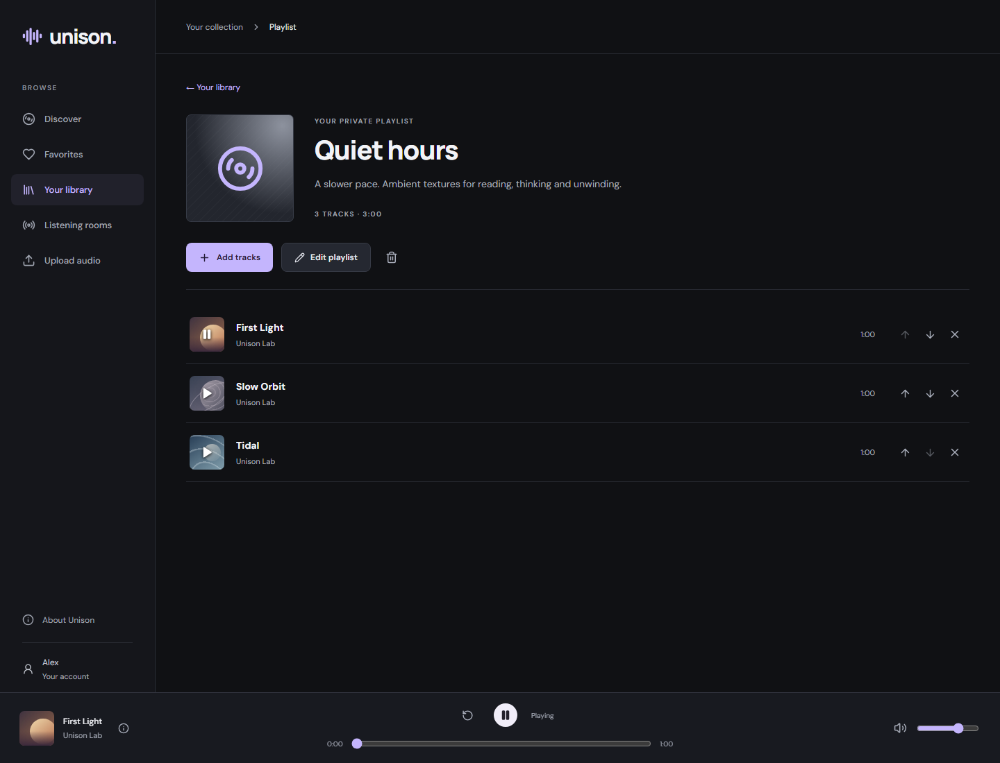
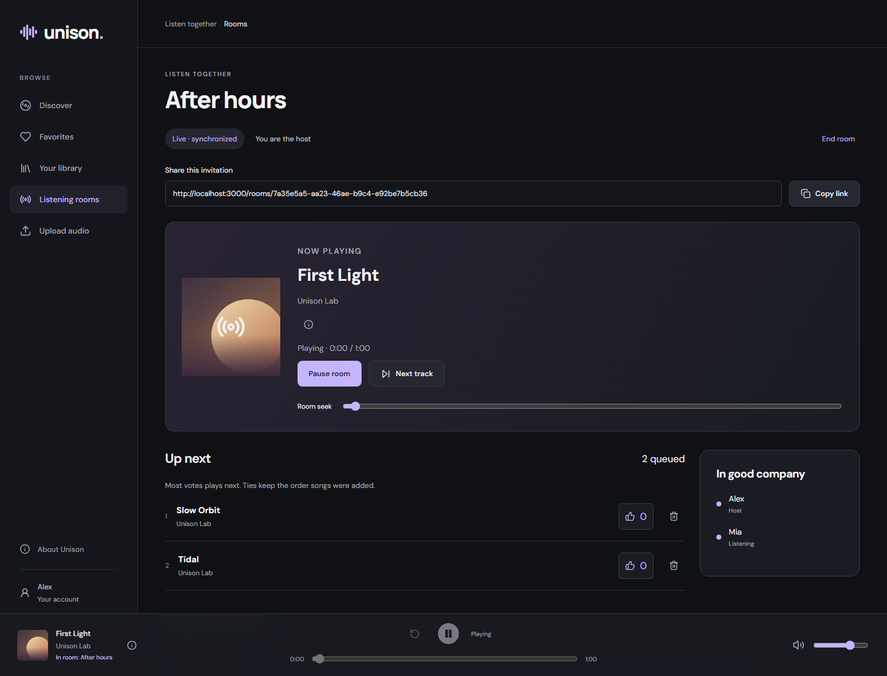
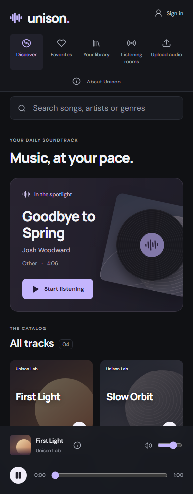

# Unison

A little space to get lost in sound.

A full-stack music application with a persistent player, personal libraries and synchronized listening rooms. Built as a Computer Engineering portfolio project with React, Spring Boot and PostgreSQL.

[Installation guide](docs/local-setup.md) · [Architecture](docs/architecture.md) · [CI checks](https://github.com/nerifilipe/unison/actions/workflows/ci.yml) · [MIT license](LICENSE)



## Features

- **Discover and listen:** backend catalog search, track credits, playback controls, seeking and volume. Music continues while navigating between pages.
- **Make it yours:** accounts, favorites and private playlists with editable details and track ordering.
- **Share your audio:** validated uploads, FFmpeg conversion, processing status and separate private permission notes/public credits.
- **Listen together:** host-controlled playback, shared queues, votes and WebSocket synchronization with reconnect recovery.
- **Use any screen:** responsive layouts, keyboard navigation, labeled controls and automated accessibility checks.

## Screenshots

### Your library

Organize tracks into playlists and keep listening while browsing.



### Listening rooms

Queue music together, see who is listening and let the host control playback.



### On mobile



Screenshots show the running local application with example library/room data. Catalog contents depend on the installation; third-party recordings visible in screenshots are not bundled with the repository. See [how to refresh screenshots](docs/screenshots.md).

## Technology

| Layer | Technology |
| --- | --- |
| Interface | React 19, TypeScript, Vite, React Router |
| API and authentication | Java 21, Spring Boot, Spring Security, server sessions and CSRF protection |
| Persistence | PostgreSQL, JPA and Flyway migrations |
| Audio | S3-compatible MinIO storage and FFmpeg processing |
| Real-time rooms | Authenticated WebSockets and server-authoritative playback |
| Local runtime | Docker Compose and an Nginx same-origin gateway |
| Verification | Backend tests, Playwright, axe and GitHub Actions |

## Scope

Designed for local installation with generated, redistributable sample audio. Accounts and libraries persist in Docker volumes; listening rooms are temporary and end when the backend restarts. Email verification and password recovery are not implemented. See the [project plan](docs/project-plan.md) for delivery history and boundaries.

## Run locally

**No cloud accounts or paid hosting required.** Each person can run an independent copy. See the [step-by-step installation guide](docs/local-setup.md) for Windows, macOS and Linux.

After installing Git and Docker:

```sh
git clone https://github.com/nerifilipe/unison.git
cd unison
```

Windows PowerShell:

```powershell
powershell -NoProfile -ExecutionPolicy Bypass -File .\scripts\local.ps1 start
```

macOS / Linux:

```sh
sh scripts/local.sh start
```

The scripts build, wait for readiness and verify catalog/audio delivery. Replace `start` with `stop`, `status`, `logs` or `verify` for everyday use. Stopping preserves data. A fresh installation contains the three generated tracks, without anyone else's accounts or uploads.

### Direct Docker commands

Prerequisites: Git and Docker Desktop running Linux containers (WSL 2 on Windows), or Docker Engine with Compose on Linux. The first build needs internet access and several minutes to download dependencies. Java, Node, Maven, PostgreSQL and FFmpeg do **not** need host installations for this path.

From the repository root:

```sh
docker compose up -d --build
```

Open **http://localhost:3000**. Click **Start listening**, navigate to **About Unison**, and confirm the player keeps playing. Audio starts only after a user gesture. Generated audio is deliberately simple ambient chords, not commercial music.

To try the personal library, select **Sign in → Create account**, choose a display name, email and password (10–64 characters), then create a playlist in **Your library**. In **Discover**, use the heart to save a favorite and the list-plus button to add a track to a playlist. Open the playlist to rename it, edit its description, reorder/remove tracks or delete it. Use **Your account → Sign out** to end the session. Registration does not send email; verification and password recovery are not implemented yet.

To publish audio, sign in and select **Upload audio**. Choose an audio-only WAV, MP3, FLAC or OGG file (up to 25 MiB, 1 second–10 minutes), enter its metadata and source/permission, and confirm your distribution rights. Follow its status under **Your uploads**, then select **Find in Discover** to play it. Failed jobs can be retried; removing an upload also removes its track from favorites/playlists. Only processed audio is public; originals are private. See [ingestion](docs/ingestion.md) for limits and lifecycle details.

Use **Public credits** for attribution that listeners must see (creator, source URL, exact license/link and required notices). The permission note remains private. Existing upload owners can open **Edit public credits** under their upload; no private note is published automatically. The information icon shows credits in Discover, favorites, the player and rooms.

To listen together, open **Listening rooms → Create room**, queue songs and copy the invitation. Open it in an incognito window on the **same computer**, sign in with another account and select **Join room**. The host selects **Play room**, and each listener selects **Enable room audio**. Members add tracks and vote; only the host can pause/seek/skip. Rooms continue across navigation and reconnect after temporary connection loss. They end when the host leaves or the backend restarts. A localhost link is not accessible from a friend's computer without a separate deployment. See [listening rooms](docs/listening-rooms.md).

Existing installations upgrade with the same startup command. Flyway adds the account/library/ingestion tables without deleting existing catalog data or audio. Sessions expire after 30 minutes idle or when the backend restarts; sign in again to restore access to persisted favorites/playlists.

```sh
docker compose ps -a
docker compose logs --tail=80 backend audio-seed frontend
docker compose down
```

`audio-seed` exiting with code 0 is expected. Database and audio persist in named volumes when stopped with `down`. `docker compose down -v` deletes the local database and audio volumes; use only for an intentional clean reset, then run the startup command again.

### Local endpoints

| Service | URL | Purpose |
| --- | --- | --- |
| App | http://localhost:3000 | Same-origin UI, API and media gateway |
| Catalog API | http://localhost:8080/api/tracks | Metadata from PostgreSQL |
| Health | http://localhost:8080/actuator/health | Backend/database readiness |
| S3 API | http://localhost:9000 | Local audio object storage |
| Storage console | http://localhost:9001 | Inspect generated audio |
| PostgreSQL | localhost:5432 | Database `unison` |

Local demo credentials are in `compose.yaml`: PostgreSQL `unison` / `unison-local`; MinIO `unison-local` / `unison-local-storage`. All published ports bind to loopback. These are development defaults, not production secrets. Docker login and cloud accounts are unnecessary.

## Develop

Frontend: Node **24 LTS** recommended (the existing Node 25 host also builds the app). The Docker build uses Node 24. Install from the committed lockfile:

```sh
cd frontend
npm ci
npm run dev
```

Open the Vite URL printed in the terminal (normally http://127.0.0.1:5173). Vite proxies `/api` to port 8080 and `/media` to local S3 port 9000; keep the Compose services running. Fonts and artwork are bundled/local.

Backend: Java **21 JDK**, with the included Maven Wrapper (Maven downloads on first use). For host execution, install FFmpeg/ffprobe on PATH, or set `UPLOAD_WORKER_ENABLED=false` to leave processing to a later worker run. The Docker backend already includes both tools. Stop only the container backend to free port 8080, leaving database/storage up:

```sh
docker compose stop backend
cd backend
sh mvnw spring-boot:run
```

On Windows use `.\mvnw.cmd spring-boot:run`. Use the Vite dev server for this host-backend workflow, since the container gateway resolves the Compose backend. Stop the host process and run `docker compose up -d backend frontend` to return to the container workflow.

## Verify

The backend Docker build runs its MVC contract and security boundary tests through `mvn verify`. Separately: `cd backend` then `sh mvnw verify` (Windows: `.\mvnw.cmd verify`).

With the Compose stack running:

```sh
cd frontend
npm ci
npx playwright install chromium
npm run build
npm run test:e2e
```

On Linux, Playwright may require `npx playwright install --with-deps chromium`. The suite runs desktop and mobile Chromium profiles, checks all three media objects and HTTP byte ranges, plays real audio, verifies audio element identity and advancing playback across routes, seeks, changes volume, switches tracks and exercises catalog/media failure recovery. Failure-state tests intercept requests; the main playback test uses the real backend and storage. Screenshots/traces: `frontend/test-results/`; HTML report: `frontend/playwright-report/`.

The library and ingestion suites register unique `unison-e2e-…@example.test` accounts, verify CSRF protection and ownership using independent sessions, and exercise favorites, playlists and uploads in the browser. Ingestion tests generate their own sine-wave audio, verify actual FFmpeg/S3 publication and playback, invalid files, size limits, retry and cascading deletion. Successful tests remove their uploaded audio; disposable accounts remain in the local database. Tests do not use your own account or contact any email service.

Optional queue recovery check, from the repository root with Node 22.12+ and Docker on PATH: `node scripts/verify-ingestion-recovery.mjs`. It simulates expired processing leases only on a disposable job it creates, verifies recovery and the retry limit, then removes the job. Set `DOCKER_BIN` to the Docker executable path if necessary.

Room tests use independent browser sessions, real WebSockets and generated demo audio, with a deliberate guest clock offset. They cover host controls, votes, conflicting commands, reconnect/reload, origins, logout and the real 30-second host-away timeout. Room state is temporary and backend tests verify its concurrency/lifecycle rules.

## Continuous integration

The browser suite also checks accessibility (axe, keyboard focus and 320px reflow) and loading budgets (compressed assets, safe caching and deferred audio). See [accessibility and performance](docs/accessibility-performance.md) for measurements, reproduction and coverage limits. There are 38 desktop/mobile tests in total.

GitHub Actions runs the frontend build, backend tests and full-stack desktop/mobile browser tests on every push and pull request. CI starts its own Docker stack with generated audio and keeps test reports and service logs for seven days. No repository secrets are needed. See [CI checks and troubleshooting](docs/continuous-integration.md).

## Structure

```text
frontend/   React, TypeScript, Vite, Playwright
backend/    Java 21, Spring Boot; catalog, identity, library, ingestion, rooms and shared modules
infra/      Nginx gateway and FFmpeg/audio seed container
docs/       Project plan, audio provenance, architecture and verification notes
scripts/    Local startup/stop helpers, audio generation and smoke checks
```

See [project plan](docs/project-plan.md), [architecture](docs/architecture.md), [audio provenance](docs/audio-provenance.md) and [verification](docs/verification.md).

Account/session behavior and the personal library API are documented in [personal library](docs/personal-library.md).

## Troubleshooting

- **Docker command/helper not found:** reopen the terminal after installation. The Windows per-user install is normally `%LOCALAPPDATA%\Programs\DockerDesktop\resources\bin`; it must be on PATH.
- **Cannot connect to Docker:** open Docker Desktop and wait for the engine. Restart Windows if WSL activation requested it.
- **Port already in use:** stop the conflicting service or change the loopback port mapping in `compose.yaml` (and Vite proxy targets for API/storage changes).
- **Catalog fails:** inspect `docker compose logs backend db`; the backend waits for PostgreSQL and validates the Flyway schema.
- **Audio fails:** inspect `docker compose logs audio-seed storage`. Rerun `docker compose run --rm audio-seed` to restore storage contents from the built seed image; it is safe to repeat.
- **Upload fails:** check the source format/duration and `docker compose logs backend storage`; restart the stack with `--build` to create the private originals bucket. Storage/processing failures can be retried from Your uploads. Interrupted processing is reclaimed after a 10-minute lease; deletion cleanup is retried automatically.
- **Room audio is silent:** select Enable room audio after the host starts a track. Check connection status and volume. Host loss of contact pauses the room after 30 seconds; the host resumes it after reconnect. Recreate the room after a backend restart. For a custom development origin, set `ROOM_ALLOWED_ORIGINS` to the exact comma-separated browser origins before starting Compose.
- **Database credentials changed:** PostgreSQL initialization variables only apply to a new volume. Use the original credentials or deliberately reset the demo volumes.

## License

Application code and generated demo audio: [MIT](LICENSE). Dependencies retain their own licenses, including the bundled fonts. No third-party music recordings are distributed.
