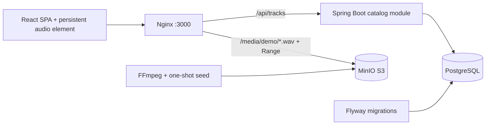

# Milestone 1 architecture

## Backend boundaries

The initial monolith groups `Track`, `TrackRepository`, `CatalogService`, `CatalogController` and public `TrackDto` in `dev.unison.catalog`. Entities and repositories are package-private. The controller depends on the service; the service owns a read-only transaction and maps entities to DTOs. `GET /api/tracks` returns an ordered JSON array, including an empty array if there are no tracks. Credentials and entity implementation details are never included.

Flyway creates the table and inserts stable IDs and object keys. Hibernate validates the schema. Future identity, library, ingestion and room modules will be separate feature packages. They are intentionally absent from milestone 1.

## Media delivery

The catalog contains same-origin media URLs. Nginx streams requests to the demo bucket, preserving `Range` and `If-Range`; MinIO supplies `206 Partial Content`, content type and content range. Named upstreams refresh through Docker DNS every five seconds so recreated services remain reachable. Audio does not pass through a Java heap buffer. There is no upload endpoint. Public read access is a local demo convenience; future private libraries need signed URLs/authorization.

The seed container builds three synthetic WAV files with FFmpeg, waits for storage, creates the bucket idempotently and uploads the files. Compose starts the frontend only after the backend is healthy and seeding succeeds. Named volumes retain metadata and audio.

## Frontend lifecycle

`PlayerProvider` is above `App` and its route tree inside `BrowserRouter`. It owns exactly one `HTMLAudioElement`, selected metadata and transport state. Router navigation does not remount the element. Selecting another track replaces its source; playback events drive state. A request sequence prevents obsolete play-promise failures from replacing current state. Catalog fetches abort on unmount and time out after 15 seconds.

Reloading stops playback by design. There is no service worker or cross-tab synchronization. Browser playback depends on user gesture, audio permissions and output volume.

## Reproducibility

Compose uses release tags, Maven pins dependencies through its parent, and npm uses a committed lockfile. Base images and Debian packages can receive patch updates; this provides repeatable setup and behavior, not byte-identical images forever. No cloud credentials are needed. Published ports bind to 127.0.0.1.
