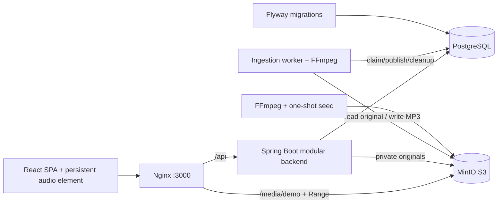

# Unison architecture

## Backend boundaries

The initial monolith groups `Track`, `TrackRepository`, `CatalogService`, `CatalogController` and public `TrackDto` in `dev.unison.catalog`. Entities and repositories are package-private. The controller depends on the service; the service owns a read-only transaction and maps entities to DTOs. `GET /api/tracks` returns an ordered JSON array, including an empty array if there are no tracks. Credentials and entity implementation details are never included.

Flyway creates the schema and inserts stable track IDs/object keys. Hibernate validates the catalog schema. `identity`, `library`, `ingestion` and `shared` are feature packages; rooms remain future work. Ingestion publishes/removes tracks through the public `CatalogPublisher` boundary; it does not access catalog entities/repositories. See [personal library](personal-library.md) and [ingestion](ingestion.md) for transaction and ownership boundaries.

`GET /api/tracks?q=...` searches title, artist and genre with a case-insensitive literal substring and a maximum 120-character term. It returns up to 100 tracks in stable catalog order. This is a bounded small-catalog query; pagination and indexed full-text search are later work.

## Media delivery

The catalog contains same-origin media URLs. Nginx streams requests to the demo bucket, preserving `Range` and `If-Range`; MinIO supplies `206 Partial Content`, content type and content range. Named upstreams refresh through Docker DNS every five seconds so recreated services remain reachable. Playback audio does not pass through Java. Uploaded originals stream into a separate private bucket; the worker uses bounded local temporary files for FFmpeg and publishes only validated output. Private playlist metadata does not make catalog audio private; future private media needs signed URLs/authorization.

The seed container builds three synthetic WAV files with FFmpeg, waits for storage, creates the bucket idempotently and uploads the files. Compose starts the frontend only after the backend is healthy and seeding succeeds. Named volumes retain metadata and audio.

## Frontend lifecycle

`PlayerProvider` is above `App` and its route tree inside `BrowserRouter`. It owns exactly one `HTMLAudioElement`, selected metadata and transport state. Router navigation does not remount the element. Selecting another track replaces its source; playback events drive state. A request sequence prevents obsolete play-promise failures from replacing current state. Catalog searches debounce for 250 ms, abort obsolete requests and time out after 15 seconds. Uploads allow a 120-second request timeout, then processing proceeds independently in the durable queue. The upload page polls every two seconds while visible jobs are pending.

Reloading stops playback by design. There is no service worker or cross-tab synchronization. Browser playback depends on user gesture, audio permissions and output volume.

## Reproducibility

Compose uses release tags, Maven pins dependencies through its parent, and npm uses a committed lockfile. Base images and Debian packages can receive patch updates; this provides repeatable setup and behavior, not byte-identical images forever. No cloud credentials are needed. Published ports bind to 127.0.0.1.
