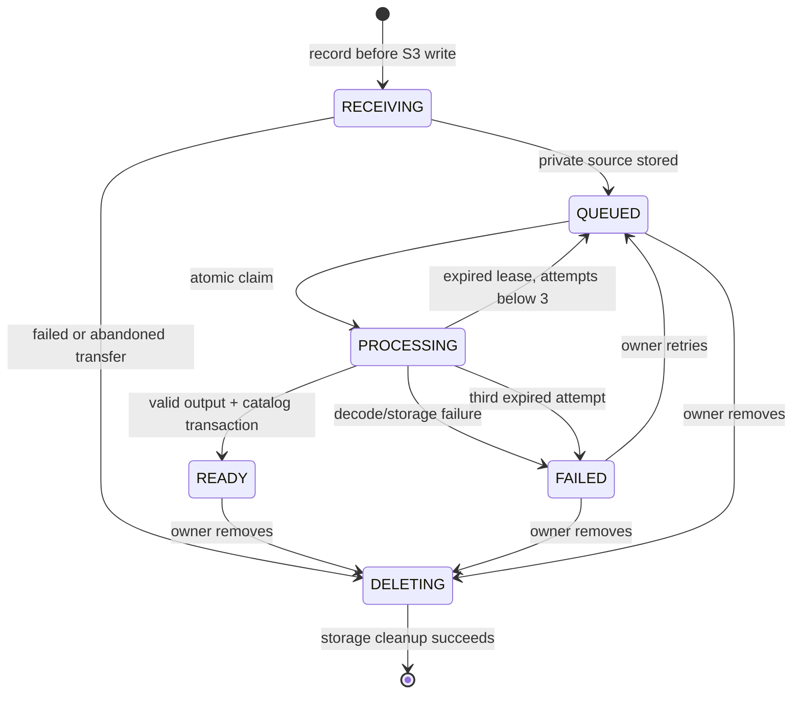

# Audio ingestion

Milestone 3 adds a local processing pipeline. Register/sign in, open **Upload audio**, select a file, supply title/artist/genre and a provenance note, and confirm permission to distribute it publicly. Rights confirmation records the uploader's declaration; it does not independently verify copyright ownership. The included demo and automated tests use only original generated audio.

## API and validation

All `/api/uploads` endpoints require a session. Every mutation also requires the CSRF token from `/api/auth/csrf`, just like library mutations.

| Method and path | Result |
| --- | --- |
| `POST /api/uploads` | Multipart `metadata` JSON part and `audio` file part; 202 with job metadata |
| `GET /api/uploads` | Current account's latest 100 jobs |
| `GET /api/uploads/{id}` | Owner's job/status; 404 for another account |
| `POST /api/uploads/{id}/retry` | 204; failed jobs only, otherwise 409 |
| `DELETE /api/uploads/{id}` | 204; hides catalog entry immediately, schedules object cleanup |
| `PUT /api/uploads/{id}/credits` | JSON `{ "publicCredits": "..." }`; 204; owner-only public attribution update |

Metadata: `title` (1–120 characters), `artist` (1–120), `genre` (1–64), `rightsConfirmed: true`, `rightsNote` (1–500), optional `publicCredits` (0–1000). Required text is trimmed and blank values rejected. Files must be nonempty, at most 25 MiB, and named with a WAV/MP3/FLAC/OGG extension. Nginx permits 26 MiB requests; Spring limits individual files to 25 MiB. Oversized multipart uploads return 413. Up to five receiving/queued/processing jobs are admitted per account, including retries; an account-level transaction lock makes concurrent admission consistent.

V4 adds public credits independently from the private provenance note. Owners can supply/edit a public plain-text attribution containing creator, source and exact license URL, required notices and changes. The track information dialog renders this as text, never as HTML. Editing credits updates the upload and published catalog row atomically; processing reads the latest credits at publication. Legacy private notes remain private and legacy uploaded tracks start with empty public credits. The application does not infer copyright permission from entered text or apply the project's MIT license to third-party uploads. Owners must include the attribution their actual license requires. Existing player snapshots refresh when a track is selected again; rooms receive fresh metadata through their snapshots.

Extensions are an initial filter. ffprobe validates actual content: exactly one audio stream, no video/embedded cover-art stream, a finite duration of 1–600 seconds (0.1 s container tolerance). FFmpeg converts to stereo 44.1 kHz MP3 at 192 kbps, strips metadata and caps output at 600 seconds; ffprobe validates the result before publication. Unsupported/corrupt input becomes a private failed job with an actionable error.

## Durable lifecycle

Flyway V3 adds `uploads` and a catalog ordering sequence. The application has one scheduled worker, running every 1.5 seconds when idle. Claims use PostgreSQL `FOR UPDATE SKIP LOCKED`; completion checks the attempt number. The status change to READY and catalog insertion share a database transaction. S3 operations are outside that publication transaction, so repeated work uses deterministic object keys and cleanup handles interrupted writes. Receiving/processing leases expire after 10 minutes. Abandoned receiving jobs are cleaned up; processing is automatically retried up to three attempts. Ordinary decoding/storage failures require an explicit owner retry.

Private sources use bucket `originals`, key `{job UUID}`. Published MP3s use public bucket `demo`, key `uploads/{job UUID}.mp3`, and are streamed through `/media/demo/uploads/...` with byte ranges. Successful originals are deleted; failed originals are retained privately for retry until the owner removes the job. Removal deletes the catalog row and cascades favorites/playlist references in one transaction. The worker deletes both objects before deleting the job. It retries cleanup when S3 is unavailable and holds the job row lock so cleanup cannot race with a retry. Receiving/processing jobs cannot be removed mid-processing (409).

Processes receive argument arrays without a shell. Only local file/pipe protocols and supported demuxers are enabled, with a 20-second probe limit, 120-second conversion limit, one decoding/encoding thread and a 64 MiB per-allocation limit. Processes are killed on timeout and temporary files removed in `finally`. The backend container runs as a non-root user. These are bounded local-demo controls, not a dedicated hostile-media sandbox; total worker/container resource quotas and a separate worker deployment are production follow-ups. An abrupt host-process crash may leave temporary files in the host's temp directory; recreating the Docker backend discards its ephemeral files.

## Configuration and operational limits

Compose supplies `S3_ENDPOINT`, `S3_ACCESS_KEY` and `S3_SECRET_KEY`, and starts the backend after the idempotent bucket seed completes. The SDK has connection/read/write timeouts. Set `UPLOAD_WORKER_ENABLED=false` for host development without FFmpeg; jobs remain queued until a worker runs. Docker includes FFmpeg/ffprobe.

Search uses `/api/tracks?q=...`, matches literal substrings in title/artist/genre and returns at most 100 results. The browser debounces and cancels obsolete searches. Upload history also returns the latest 100 jobs. Pagination, total storage quotas, moderation, account rate limits and private-media delivery are not implemented. Deleting an audio object cannot revoke bytes already downloaded into a browser player.

## Repeat verification

Run `npx playwright test` from `frontend/` against the Compose stack. Ingestion tests create a four-second sine wave in memory, upload it through the real form, wait for processing, play the resulting MP3, check S3 ranges/privacy, and remove it. Additional checks cover size/format/rights validation, CSRF, another account, corrupt audio and retry. Java tests cover probe stream/duration validation.

From the repository root, `node scripts/verify-ingestion-recovery.mjs` verifies lease expiry and the attempt limit. It creates a disposable failed job, changes only that job's database row to simulate interrupted processing, waits for the live worker, and deletes it. This exercises recovery against PostgreSQL/S3; it does not kill the backend or alter user uploads. Disposable test accounts remain in the database.
